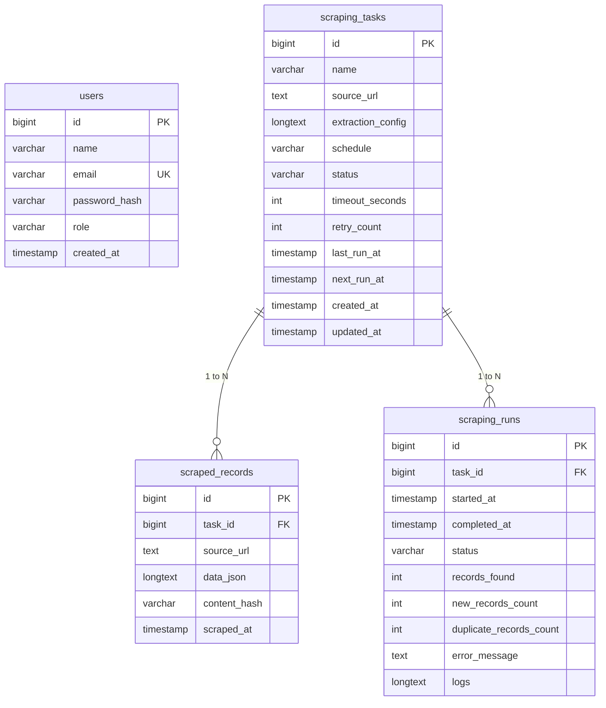

# Java Web Data Scraper & Management System

> Full-stack Java web application for automated collection, processing, storage, scheduling, monitoring, and management of web data.
> Built with **Spring Boot (Java 17 LTS)**, **React.js**, **Jsoup**, **MySQL 8.0**, and **Docker**.

---

## 📋 Table of Contents
1. [Project Overview](#-project-overview)
2. [Architecture & Technology Stack](#-architecture--technology-stack)
3. [Database Schema (ER Diagram)](#-database-schema)
4. [Quick Start with Docker (Recommended)](#-quick-start-with-docker-zero-manual-db-setup)
5. [Local Development (Fallback without Docker)](#-local-development-fallback-without-docker)
6. [Demo Credentials & Seed Data](#-demo-credentials--seed-data)
7. [REST API Documentation](#-rest-api-documentation)
8. [Features & Screen Walkthrough](#-features--screen-walkthrough)
9. [Viva / Demonstration Sequence](#-viva--demonstration-sequence)
10. [Design Decisions & Scraper Safety](#-design-decisions--scraper-safety)

---

## 🌟 Project Overview
The **Java Web Data Scraper & Management System** eliminates repetitive manual web-data collection by providing an automated, scalable workflow:
- **Visual Selector Builder**: Define CSS selectors for multi-item containers or single-page entities without writing code.
- **Live Test Scrape**: Real-time extraction preview showing HTTP status, items found, duration, and JSON payload prior to saving tasks.
- **Automated Scheduling**: Cron-based background scheduler triggers tasks automatically at custom intervals (15 mins, hourly, daily, weekly, or custom cron).
- **Cryptographic Deduplication**: Computes deterministic SHA-256 content hashes (`content_hash`) over normalized JSON payloads to prevent duplicate record insertion.
- **Data Explorer & Exporter**: Search, filter, and inspect structured data with one-click **CSV** and **JSON** exports.
- **Execution Run Logging**: Full execution timeline and structured logs recording HTTP connection attempts, retry backoffs, and error traces.

---

## 🏗️ Architecture & Technology Stack

```mermaid
flowchart TD
    subgraph Frontend["Frontend Client (Port: 5173)"]
        UI[React.js SaaS Dashboard UI]
        Router[React Router v6]
        AuthCtx[Auth Context & JWT Storage]
        AxiosClient[Axios Interceptors API Client]
        Pages[Dashboard | Tasks | Task Builder | Data Explorer | Run Details | Settings]
    end

    subgraph Backend["Spring Boot REST API (Port: 8080)"]
        Security[Spring Security + JWT Bearer Auth]
        Controllers[REST Controllers & Validation DTOs]
        TaskService[Task Management Service]
        Scheduler[TaskScheduler & Dynamic Cron Runner]
        DataProcessor[Data Cleaner & SHA-256 Deduplication]
        JsoupEngine[Jsoup HTML Scraper Engine]
        Repo[Spring Data JPA & Hibernate]
    end

    subgraph Database["MySQL 8.0 Storage (Port: 3306)"]
        UsersTbl[(users)]
        TasksTbl[(scraping_tasks)]
        RecordsTbl[(scraped_records)]
        RunsTbl[(scraping_runs)]
    end

    subgraph Web["Public Targets (Permitted)"]
        Websites[books.toscrape.com / quotes.toscrape.com]
    end

    UI --> AxiosClient
    AxiosClient -->|REST JSON with Bearer Token| Security
    Security --> Controllers
    Controllers --> TaskService
    Scheduler --> TaskService
    TaskService --> JsoupEngine
    JsoupEngine -->|HTTP GET Request| Websites
    JsoupEngine --> DataProcessor
    DataProcessor --> Repo
    Repo --> Database
```

### Technology Matrix
| Layer | Technology | Version / Details | Purpose |
|---|---|---|---|
| **Frontend** | React.js (Vite) | 18.2 | Fast, modular component architecture |
| **Routing** | React Router | 6.22 | Client routing & protected auth routes |
| **Styling** | Tailwind CSS | 3.4 | Modern dark-mode SaaS dashboard design |
| **Charts** | Recharts | 2.12 | Trend area charts & distribution bar charts |
| **Icons** | Lucide React | 0.36 | Crisp UI iconography |
| **Backend** | Java + Spring Boot | 17 LTS / 3.2.4 | REST API & asynchronous background processing |
| **HTML Parser**| Jsoup | 1.17.2 | Robust CSS selector extraction engine |
| **Security** | Spring Security + JJWT | 0.11.5 | Stateless JWT authentication & BCrypt hashing |
| **Persistence**| Spring Data JPA / Hibernate | 3.2 | ORM and transactional query layer |
| **Database** | MySQL | 8.0 | Relational storage for users, tasks, records, runs |
| **Container** | Docker & Docker Compose | Multi-stage | Zero-manual setup container orchestration |

---

## 🗄️ Database Schema



---

## 🚀 Quick Start with Docker (Zero Manual DB Setup)

The repository provides a complete `docker-compose.yml` that provisions MySQL 8.0, the Spring Boot backend, and the React frontend automatically.

### 1. Clone & Setup Environment
```bash
git clone https://github.com/Sanjay567-coder/WebScaper.git
cd WebScaper

# Copy environment configuration
cp .env.example .env
```

### 2. Start all containers
```bash
docker-compose up --build -d
```

### 3. Access Services
- **Frontend Admin Dashboard**: [http://localhost:5173](http://localhost:5173)
- **Backend REST API**: [http://localhost:8080/api](http://localhost:8080/api)
- **MySQL Database**: `localhost:3306` (Database: `webscraper_db`, User: `scraper_user`, Pass: `scraper_pass`)

To stop all services:
```bash
docker-compose down
```

---

## 🛠️ Local Development (Fallback without Docker)

If Docker is unavailable, you can run all services directly on your machine.

### Prerequisites
- **Java 17 (LTS)** JDK installed
- **Node.js 18+** & npm installed
- **MySQL 8.0** server running locally

### 1. Initialize Local MySQL Database
```bash
mysql -u root -p < docker/mysql/init.sql
```

### 2. Run the Spring Boot Backend
```bash
cd backend

# On Windows
./mvnw.cmd spring-boot:run

# On Linux / macOS
./mvnw spring-boot:run
```
Backend will start on [http://localhost:8080](http://localhost:8080).

### 3. Run the React Frontend
```bash
cd frontend
npm install
npm run dev
```
Frontend will be available on [http://localhost:5173](http://localhost:5173).

---

## 🔑 Demo Credentials & Seed Data

The database initializes automatically with an administrator account and 2 sample scraping tasks pointed at public test sites:

| Role | Email | Password |
|---|---|---|
| **System Administrator** | `admin@webscraper.local` | `Admin@123` |

### Pre-Seeded Public Scraping Tasks
1. **Books to Scrape - Catalogue Explorer**
   - **Target**: `https://books.toscrape.com/catalogue/category/books_1/index.html`
   - **Container Selector**: `article.product_pod`
   - **Fields**: `title`, `price`, `availability`, `rating`, `detailUrl`, `thumbnailUrl`
2. **Quotes to Scrape - Quotes Collector**
   - **Target**: `https://quotes.toscrape.com/`
   - **Container Selector**: `div.quote`
   - **Fields**: `quote`, `author`, `authorUrl`, `tags`

---

## 📡 REST API Documentation

All protected endpoints require the header `Authorization: Bearer <JWT_TOKEN>`.

### 1. Authentication
| Method | Endpoint | Description |
|---|---|---|
| `POST` | `/api/auth/login` | Authenticate admin with email/password; returns JWT |
| `GET` | `/api/auth/me` | Retrieve authenticated user session details |

### 2. Dashboard
| Method | Endpoint | Description |
|---|---|---|
| `GET` | `/api/dashboard` | Aggregated KPIs, 7-day trend chart, distribution, and recent runs |

### 3. Scraping Tasks
| Method | Endpoint | Description |
|---|---|---|
| `GET` | `/api/tasks` | Paginated, searchable, status-filtered task list |
| `POST` | `/api/tasks` | Create new scraping task with JSON selector config |
| `GET` | `/api/tasks/{id}` | Retrieve specific task details |
| `PUT` | `/api/tasks/{id}` | Update task configuration, schedule, or selectors |
| `DELETE` | `/api/tasks/{id}` | Delete task, cascading to records and run logs |
| `PATCH` | `/api/tasks/{id}/status` | Toggle status (`ACTIVE` / `PAUSED` / `DRAFT`) |
| `POST` | `/api/tasks/test` | Ad-hoc live test scrape preview before saving |
| `POST` | `/api/tasks/{id}/test` | Live test scrape preview for existing task |
| `POST` | `/api/tasks/{id}/run` | Instant manual execution trigger ("Run Now") |
| `GET` | `/api/tasks/{id}/runs` | Retrieve execution history for a specific task |

### 4. Scraped Data Explorer
| Method | Endpoint | Description |
|---|---|---|
| `GET` | `/api/data` | Search, filter by task/date, sort, and paginate records |
| `GET` | `/api/data/{id}` | Retrieve single record with parsed JSON map |
| `DELETE` | `/api/data/{id}` | Delete scraped record |

### 5. Execution Runs & Diagnostics
| Method | Endpoint | Description |
|---|---|---|
| `GET` | `/api/runs` | Global chronological execution run logs |
| `GET` | `/api/runs/{id}` | Detailed execution run with full terminal output |
| `GET` | `/api/settings` | Global scraping defaults and scheduler status |
| `PUT` | `/api/settings/profile`| Update administrator profile name & password |
| `GET` | `/api/system/health` | Live JVM memory, uptime, and database connectivity |

---

## 🖥️ Viva / Demonstration Sequence

Follow this step-by-step sequence during project evaluation or viva:

1. **Sign In**: Navigate to [http://localhost:5173](http://localhost:5173), enter `admin@webscraper.local` / `Admin@123`.
2. **Dashboard Overview**: Explain the 4 KPI cards, the 7-day scraping activity trend (Recharts), and task distribution.
3. **Inspect Existing Tasks**: Open **Scraping Tasks**, review the pre-configured *Books to Scrape* task.
4. **Create a New Task**: Click **New Scraping Task**, click **Templates: Quotes Collector**, or enter a custom URL.
5. **Demonstrate Live Test Scrape**: Click **Test Scrape Preview** to show live HTML fetching and JSON parsing without persisting records.
6. **Execute Run Now**: Save the task and click **Run Now**. Observe execution summary badge showing extracted and newly saved records.
7. **Demonstrate Deduplication**: Click **Run Now** a second time. Show that 0 new records were added and all items were flagged as duplicates via SHA-256 hashing.
8. **Explore Data**: Navigate to **Data Explorer**, perform a search keyword filter, open the **Inspect JSON Details** modal, and demonstrate **Export to CSV** and **Export to JSON**.
9. **Inspect Run Logs**: Open **Run History**, click **View Logs** on a recent run to inspect the structured Jsoup connection logs.
10. **System Diagnostics**: Open **Settings** to show live JVM memory metrics and database connectivity status.

---

## 🛡️ Design Decisions & Scraper Safety

1. **Scraping Safety Compliance**:
   - Only public/permitted test sources are scraped by default (`books.toscrape.com`, `quotes.toscrape.com`).
   - Standard browser User-Agent headers and reasonable timeouts prevent overloading target servers.
   - Strictly no CAPTCHA bypassing, paywall cracking, or anti-bot circumvention is implemented.
2. **Deduplication Strategy**:
   - Content fields are cleaned, keys are canonically sorted, and a cryptographic **SHA-256** hash is generated per item.
   - If `scraped_records` already contains a matching hash for that task ID, the record is flagged as duplicate and skipped.
3. **Stateless Security**:
   - Authentication uses standard JWT Bearer tokens with BCrypt password hashing.
   - Ports are pinned consistently across frontend (`5173`), backend (`8080`), and MySQL (`3306`).