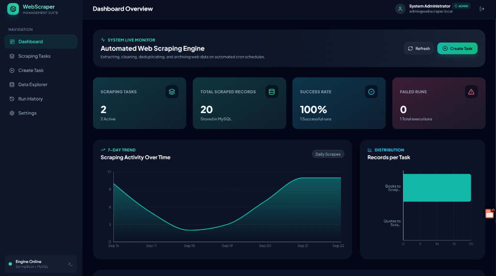
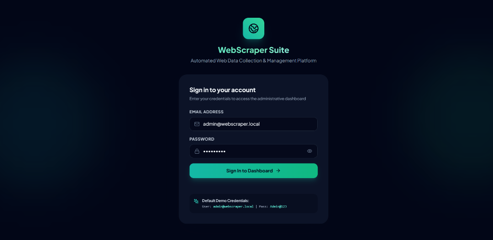
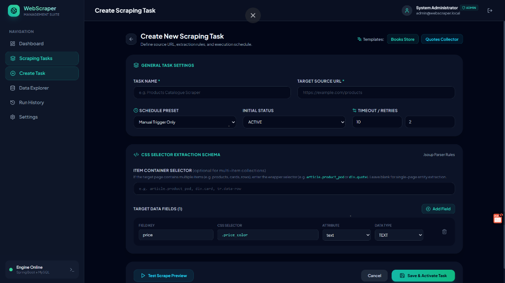
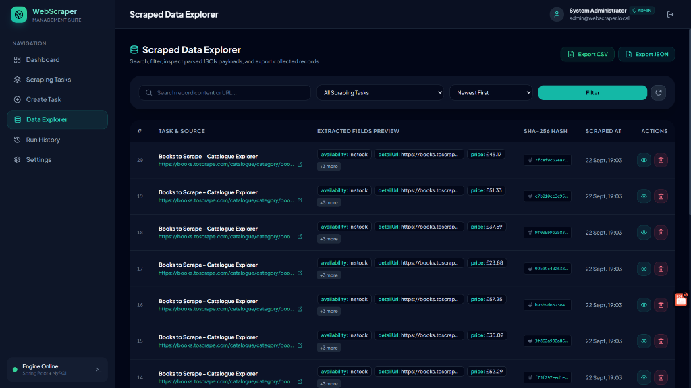
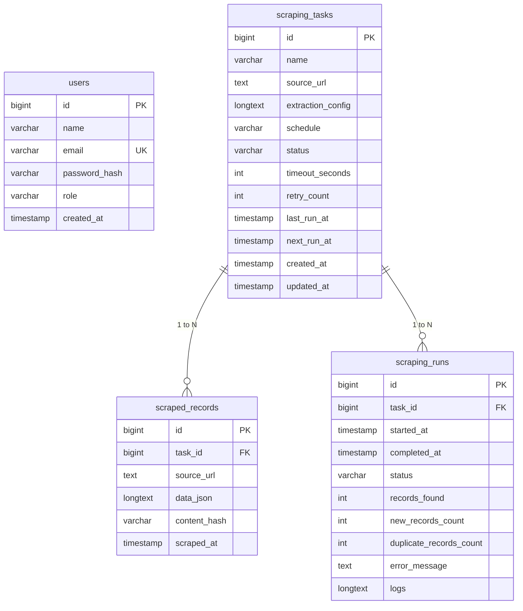

# 🚀 Java Web Data Scraper & Management System

<p align="center">
  
</p>

<p align="center">
  <b>Full-stack Java web platform for automated collection, processing, storage, scheduling, monitoring, and management of web data.</b>
</p>

<p align="center">
  
  
  
  
  
  
</p>

---

## 📋 Table of Contents
1. [🌟 Project Highlights](#-project-highlights)
2. [📸 Real Application Screenshots](#-real-application-screenshots)
3. [🏗️ Architecture & Technology Stack](#-architecture--technology-stack)
4. [🗄️ Database Schema & ER Diagram](#-database-schema--er-diagram)
5. [⚡ Quick Start with Docker (Zero Manual DB Setup)](#-quick-start-with-docker-recommended)
6. [🛠️ Local Development (Fallback without Docker)](#-local-development-fallback-without-docker)
7. [🔑 Default Credentials & Seed Tasks](#-default-credentials--seed-tasks)
8. [📡 REST API Specification](#-rest-api-specification)
9. [🖥️ Step-by-Step Viva / Demo Sequence](#-step-by-step-viva--demo-sequence)
10. [🛡️ Scraping Safety & Deduplication Engine](#-scraping-safety--deduplication-engine)

---

## 🌟 Project Highlights

- **Visual Selector Builder**: Build extraction rules dynamically using CSS selectors (text, HTML, image URLs, links, attributes, and arrays) without writing backend code.
- **Interactive Test Scrape Preview**: Validate and preview live extracted JSON before saving tasks with duration and HTTP status feedback.
- **Automated Cron Scheduling**: Background `TaskScheduler` executes recurring scraping jobs (every 15 mins, hourly, daily, weekly, or custom cron syntax).
- **Cryptographic SHA-256 Deduplication**: Calculates deterministic content hashes over canonical JSON records to prevent duplicate data insertion.
- **Scraped Data Explorer**: Search, filter by task/date, multi-column sorting, JSON inspector modal, and instant **CSV** and **JSON** exports.
- **Structured Execution Run Logs**: Comprehensive execution run tracking with duration metrics, new vs. duplicate count breakdown, and live terminal logs.
- **Stateless JWT Security**: Protected REST endpoints using Spring Security and HMAC-SHA256 tokens with BCrypt password hashing.

---

## 📸 Real Application Screenshots

### 1. Dashboard Overview & Real-Time Analytics
The executive dashboard provides real-time KPI metrics (Active Tasks, Total Records, Success Rate %, and Failed Runs), an interactive 7-day trend chart, record distribution, and recent run execution controls.

<p align="center">
  
</p>

---

### 2. Administrator Authentication & Security
Professional, centered authentication card with input validation, password visibility toggling, error state feedback, and seeded credentials hints.

<p align="center">
  
</p>

---

### 3. Scraping Task Builder & Extraction Rules
Configure target URLs, schedule presets (Hourly, Daily, or Custom Cron), dynamic CSS selector rows with data type mapping, and live Test Scrape Preview.

<p align="center">
  
</p>

---

### 4. Scraped Data Explorer & Multi-Format Exporter
Search, filter by task or date range, inspect parsed structured JSON payloads with deep drawer inspector, verify cryptographic SHA-256 hashes, and export data to **CSV** or **JSON** with one click.

<p align="center">
  
</p>

---

## 🏗️ Architecture & Technology Stack

```mermaid
flowchart TD
    subgraph Frontend["Frontend Layer (Port: 5173)"]
        UI[React 18 + Tailwind CSS + Lucide Icons]
        Router[React Router v6 Protected Routes]
        AuthCtx[Auth Context & Local JWT Storage]
        AxiosClient[Axios Interceptors API Client]
        Pages[Dashboard | Tasks | Builder | Explorer | Runs | Settings]
    end

    subgraph Backend["Spring Boot 3.2 Backend (Port: 8080)"]
        Security[Spring Security + JWT Bearer Auth]
        Controllers[REST Controllers & Validation DTOs]
        TaskService[Task Management Service]
        Scheduler[TaskScheduler & Dynamic Cron Runner]
        DataProcessor[Data Cleaner & SHA-256 Deduplication]
        JsoupEngine[Jsoup HTML Scraper Engine]
        Repo[Spring Data JPA & Hibernate]
    end

    subgraph Database["MySQL 8.0 Storage (Port: 3307)"]
        UsersTbl[(users)]
        TasksTbl[(scraping_tasks)]
        RecordsTbl[(scraped_records)]
        RunsTbl[(scraping_runs)]
    end

    subgraph Web["Public Targets (Permitted)"]
        Websites[books.toscrape.com / quotes.toscrape.com]
    end

    UI --> AxiosClient
    AxiosClient -->|REST JSON with Bearer Token| Security
    Security --> Controllers
    Controllers --> TaskService
    Scheduler --> TaskService
    TaskService --> JsoupEngine
    JsoupEngine -->|HTTP GET Request| Websites
    JsoupEngine --> DataProcessor
    DataProcessor --> Repo
    Repo --> Database
```

---

## 🗄️ Database Schema & ER Diagram



---

## ⚡ Quick Start with Docker (Recommended)

Zero manual database or backend setup required. Docker Compose orchestrates the full stack in seconds.

### 1. Clone & Copy Configuration
```bash
git clone https://github.com/Sanjay567-coder/WebScaper.git
cd WebScaper
cp .env.example .env
```

### 2. Start Full Stack
```bash
docker-compose up -d
```

### 3. Access Services
- **Frontend Dashboard**: [http://localhost:5173](http://localhost:5173)
- **Backend REST API**: [http://localhost:8080/api](http://localhost:8080/api)
- **MySQL Database**: `localhost:3307` (Database: `webscraper_db`, User: `scraper_user`, Pass: `scraper_pass`)

To stop all containers:
```bash
docker-compose down
```

---

## 🛠️ Local Development (Fallback without Docker)

If you prefer to run services natively on your local machine:

### Prerequisites
- **Java 17 (LTS)** JDK installed
- **Node.js 18+** & npm installed
- **MySQL 8.0** server running locally

### 1. Initialize MySQL Database
```bash
mysql -u root -p < docker/mysql/init.sql
```

### 2. Run Backend
```bash
cd backend

# Windows
./mvnw.cmd spring-boot:run

# Linux / macOS
./mvnw spring-boot:run
```
Backend will start on `http://localhost:8080`.

### 3. Run Frontend
```bash
cd frontend
npm install
npm run dev
```
Frontend will be available on `http://localhost:5173`.

---

## 🔑 Default Credentials & Seed Tasks

### Administrator Login
| Role | Email | Password |
|---|---|---|
| **System Administrator** | `admin@webscraper.local` | `Admin@123` |

### Pre-Configured Scraping Tasks
1. **Books to Scrape - Catalogue Explorer**
   - **URL**: `https://books.toscrape.com/catalogue/category/books_1/index.html`
   - **Container Selector**: `article.product_pod`
   - **Fields**: `title`, `price`, `availability`, `rating`, `detailUrl`, `thumbnailUrl`
2. **Quotes to Scrape - Quotes Collector**
   - **URL**: `https://quotes.toscrape.com/`
   - **Container Selector**: `div.quote`
   - **Fields**: `quote`, `author`, `authorUrl`, `tags`

---

## 📡 REST API Specification

All protected endpoints require the header `Authorization: Bearer <JWT_TOKEN>`.

### Authentication
- `POST /api/auth/login`: Authenticates credentials, returns JWT bearer token and user object.
- `GET /api/auth/me`: Retrieves current session profile.

### Dashboard
- `GET /api/dashboard`: Returns aggregated KPI cards, 7-day scraping activity trend, task record distribution, and recent runs.

### Scraping Tasks
- `GET /api/tasks`: Paginated, keyword-searchable, and status-filtered task list.
- `POST /api/tasks`: Creates a new scraping task with JSON selector configuration.
- `GET /api/tasks/{id}`: Retrieves task details.
- `PUT /api/tasks/{id}`: Updates task details, selectors, and schedule.
- `DELETE /api/tasks/{id}`: Deletes task and associated records/runs.
- `PATCH /api/tasks/{id}/status`: Quick toggle (`ACTIVE`, `PAUSED`, `DRAFT`).
- `POST /api/tasks/test`: Live test scrape preview without saving.
- `POST /api/tasks/{id}/test`: Live test scrape preview for existing task.
- `POST /api/tasks/{id}/run`: Instant manual "Run Now" execution.
- `GET /api/tasks/{id}/runs`: Retrieves execution history for a specific task.

### Scraped Data Explorer
- `GET /api/data`: Full-text search across JSON attributes, task filter, date filter, sorting, and pagination.
- `GET /api/data/{id}`: Single record with parsed JSON payload.
- `DELETE /api/data/{id}`: Deletes a scraped record.

### Execution Runs & Diagnostics
- `GET /api/runs`: Global chronological execution runs.
- `GET /api/runs/{id}`: Full structured execution log details.
- `GET /api/settings`: Scraper defaults and scheduler status.
- `PUT /api/settings/profile`: Updates administrator profile name and password.
- `GET /api/system/health`: Live JVM heap memory, server uptime, and database connectivity.

---

## 🖥️ Step-by-Step Viva / Demo Sequence

1. **Sign In**: Navigate to `http://localhost:5173` and log in with `admin@webscraper.local` / `Admin@123`.
2. **Explain Dashboard**: Point out the 4 KPI cards, the 7-day trend chart, and task distribution bar chart.
3. **Inspect Existing Tasks**: Open **Scraping Tasks** to view pre-seeded demo tasks.
4. **Create Task & 1-Click Templates**: Click **New Scraping Task**, load the *Quotes Collector* template, and explain how CSS selectors map to HTML elements.
5. **Demonstrate Test Scrape**: Click **Test Scrape Preview** to show live HTML fetching, parsing, duration, and JSON output before saving.
6. **Trigger "Run Now"**: Save the task, click **Run Now**, and observe the status pill changing to `SUCCESS` with record counters.
7. **Demonstrate Deduplication**: Click **Run Now** a second time. Point out that 0 new records were added because the SHA-256 content hash detected matching content.
8. **Explore & Export Data**: Open **Data Explorer**, search by keyword, view the JSON modal, and click **Export CSV** and **Export JSON**.
9. **Inspect Logs**: Open **Run History**, click **View Logs** to show the structured timestamped terminal output.
10. **System Diagnostics**: Open **Settings** to inspect live JVM heap memory and database connection status.

---

## 🛡️ Scraping Safety & Deduplication Engine

1. **Ethical Scraping Principles**:
   - Only permitted, public test resources (`books.toscrape.com`, `quotes.toscrape.com`) are configured by default.
   - Strictly no CAPTCHA bypassing, paywall cracking, or anti-bot circumvention is implemented.
   - Polite HTTP user-agent headers and request timeouts prevent overloading servers.
2. **Deduplication Hashing Algorithm**:
   - Raw extracted data is sanitized and keys are canonically sorted into deterministic JSON.
   - Cryptographic **SHA-256** hash is calculated.
   - If an existing record with the same hash exists for the task, it is flagged as duplicate and skipped from insertion.